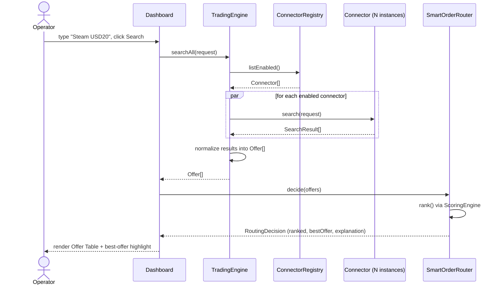
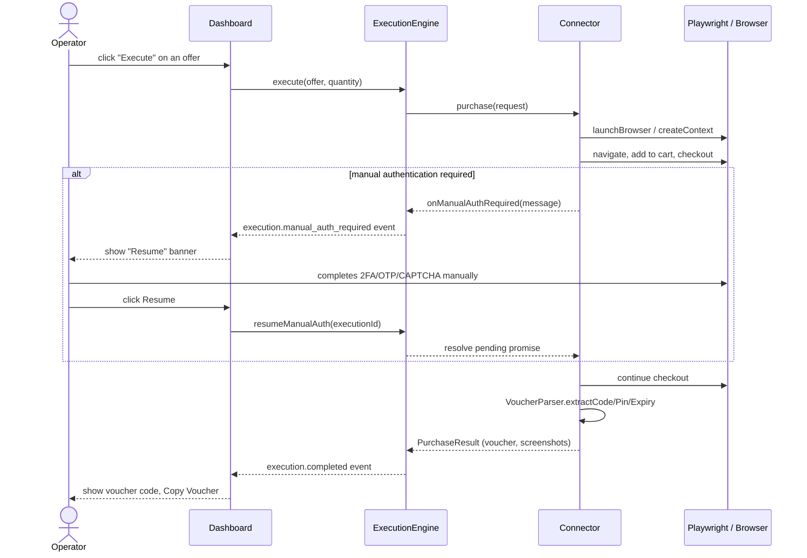

# Architecture

This is a **personal procurement terminal**, not a marketplace or SaaS. One
operator, one dashboard, zero customers. Everything below describes the
framework that is shipped — no vendor connector is implemented anywhere in
this repository (see [`src/connectors/README.md`](../src/connectors/README.md)).

## Layered flow

```
Dashboard
  ↓
Trading Engine        (searchAll — fans out to every enabled connector)
  ↓
Smart Order Router    (ranks Offer[] by weighted score, explains the pick)
  ↓
Connector Manager      (ConnectorRegistry — DI, no hardcoded connectors)
  ↓
Playwright Connector   (abstract base: browser lifecycle, retries, screenshots)
  ↓
External Website       (real site the operator is personally authorized to use)
  ↓
Voucher Extraction     (VoucherParser — generic code/PIN/expiry parsing)
  ↓
Dashboard
```

## Class diagram


## Sequence diagram — search



## Sequence diagram — purchase (with manual-auth pause)



## Scoring formula

```
FinalScore =
    PriceWeight        * PriceScore
  + AvailabilityWeight * AvailabilityScore
  + SpeedWeight        * SpeedScore
  + ReliabilityWeight  * ReliabilityScore
  - RiskWeight         * RiskScore
```

- `PriceScore = lowestPrice / currentPrice`
- `AvailabilityScore = offer.available ? 1 : 0`
- `SpeedScore = 1 - (searchTime / maxSearchTimeMs)`
- `ReliabilityScore = successfulExecutions / totalExecutions` (from `ExecutionHistory`)
- `RiskScore` — manually configured per connector (`Settings` table, key `risk:<connectorId>`), one of `0 / 0.2 / 0.5 / 1`

All weights live in [`config/default.yaml`](../config/default.yaml) and are
validated by [`src/config/config.schema.ts`](../src/config/config.schema.ts).

## Why no vendor code exists here

The brief for this project is explicit: never fabricate a website, vendor,
domain, or product catalog. Every piece above is real, generic, and
testable on its own — the only thing missing is the one file a real
connector would add (`src/connectors/<name>.connector.ts`), which requires
knowing an actual site the operator has an account with.
