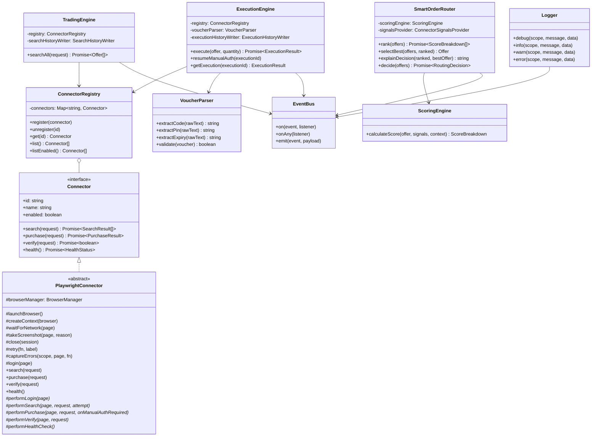
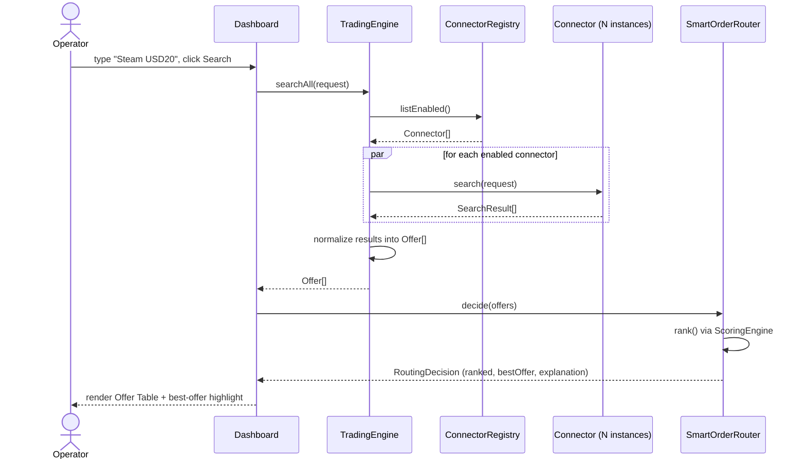
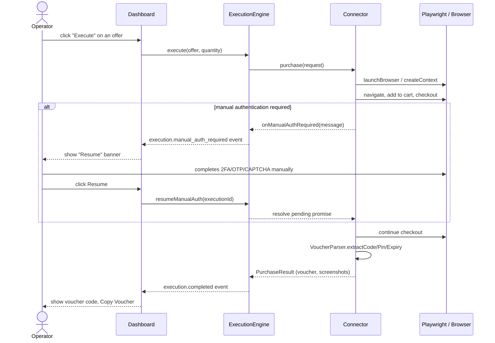

# Architecture

This is a **personal procurement terminal**, not a marketplace or SaaS. One
operator, one dashboard, zero customers. Everything below describes the
framework that is shipped, plus four real connectors (Eneba's search is
fully working; G2A/CardCash/Kinguin are empty shells blocked by
bot-detection during inspection) — see
[`src/connectors/README.md`](../src/connectors/README.md) for the full
status table.

## Layered flow

```
Dashboard
  ↓
Trading Engine        (searchAll — fans out to every enabled connector)
  ↓
Smart Order Router    (ranks Offer[] by weighted score, explains the pick)
  ↓
Connector Manager      (ConnectorRegistry — DI, no hardcoded connectors)
  ↓
Playwright Connector   (abstract base: browser lifecycle, retries, screenshots)
  ↓
External Website       (real site the operator is personally authorized to use)
  ↓
Voucher Extraction     (VoucherParser — generic code/PIN/expiry parsing)
  ↓
Dashboard
```

## Class diagram



## Sequence diagram — search



## Sequence diagram — purchase (with manual-auth pause)



## Scoring formula

```
FinalScore =
    PriceWeight        * PriceScore
  + AvailabilityWeight * AvailabilityScore
  + SpeedWeight        * SpeedScore
  + ReliabilityWeight  * ReliabilityScore
  - RiskWeight         * RiskScore
```

- `PriceScore = lowestPrice / currentPrice`
- `AvailabilityScore = offer.available ? 1 : 0`
- `SpeedScore = 1 - (searchTime / maxSearchTimeMs)`
- `ReliabilityScore = successfulExecutions / totalExecutions` (from `ExecutionHistory`)
- `RiskScore` — manually configured per connector (`Settings` table, key `risk:<connectorId>`), one of `0 / 0.2 / 0.5 / 1`

All weights live in [`config/default.yaml`](../config/default.yaml) and are
validated by [`src/config/config.schema.ts`](../src/config/config.schema.ts).

## Why some connectors are empty

The brief for this project is explicit: never fabricate a website, vendor,
domain, or product catalog, and never bypass bot-detection to inspect one.
`EnebaConnector.performSearch` is real because Eneba's search page was
actually inspectable (server-rendered GraphQL state). G2A/CardCash/Kinguin
all blocked plain inspection with bot-detection, so their connectors are
honest empty shells rather than guessed selectors — see
[`src/connectors/README.md`](../src/connectors/README.md).

## Public demo backend

The GitHub Pages site (https://siwach-a11y.github.io/giftcard-trading-terminal/)
is a **static export** — no server, so its Search/Execute/live-log are
disabled by default. At the operator's request, a second deployment exists
purely so that public page can show real search results: a **search-only**
copy of this same app runs on Cloud Run (`Dockerfile`, `docker-entrypoint.sh`,
`config/cloud.yaml`), and the static site is built with
`NEXT_PUBLIC_API_BASE_URL` pointed at it (`npm run deploy:pages:live`).

This deployment is deliberately narrow:

- **Headless only, `browser.headless: true`.** Manual-auth pause/resume
  requires a visible browser window, which a cloud container can never
  provide — so this backend only ever supports connectors whose `search()`
  doesn't need a login (currently: Eneba). Purchase execution must run
  locally (`npm run dev`) where you can actually see and interact with the
  browser.
- **No persistence across restarts.** Cloud Run gives each new container
  instance a fresh filesystem; a pre-migrated empty SQLite database is
  baked into the image and copied to `/tmp` on every cold start.
- **CORS locked to the GitHub Pages origin and a small in-memory per-IP
  rate limit** (`src/middleware.ts`), plus `concurrency=1`/`max-instances=2`
  on the Cloud Run service — this is a public, unauthenticated backend, so
  these exist to bound cost and abuse risk, not to make it robust at scale.
- **The Playwright npm package version and the `mcr.microsoft.com/playwright`
  Docker image tag must match exactly** — playwright-core refuses to launch
  a browser build that doesn't match its own version. `playwright` is
  pinned (not caret-ranged) in `package.json` specifically so this can't
  silently drift on a future `npm install`.
